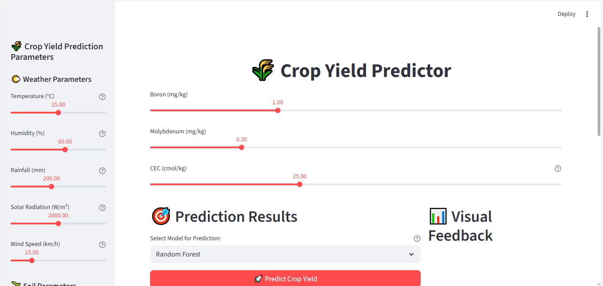
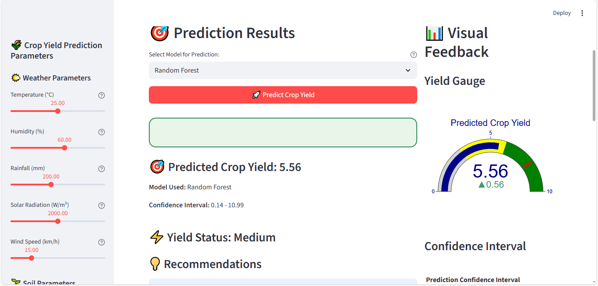
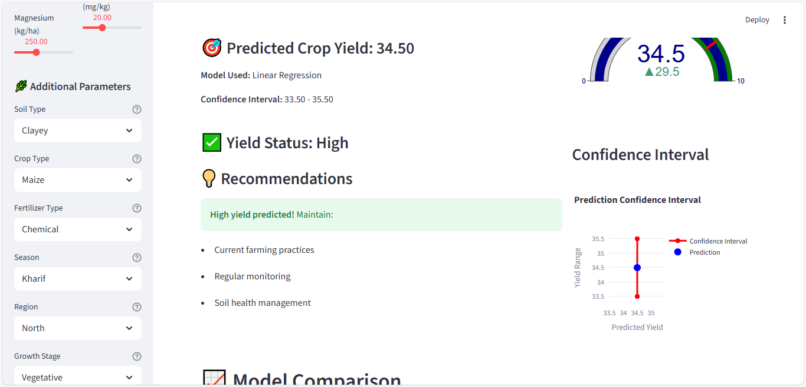
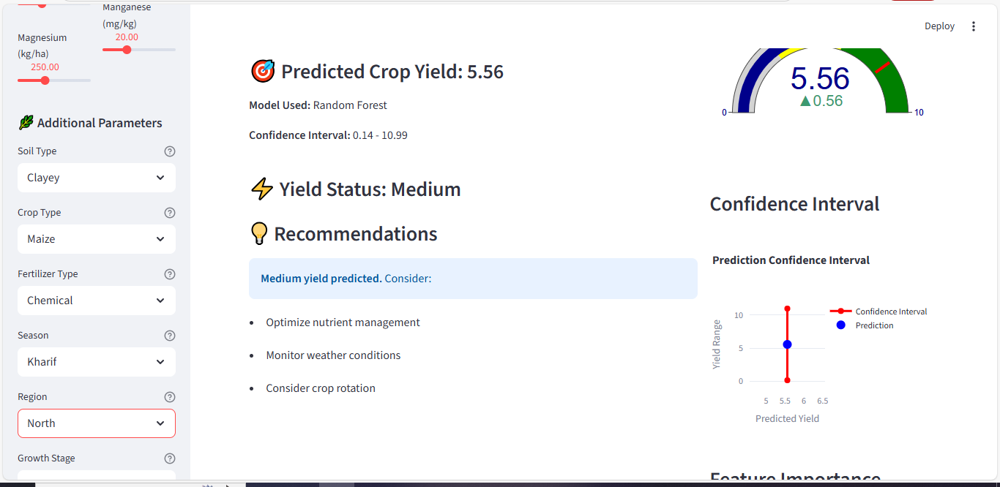
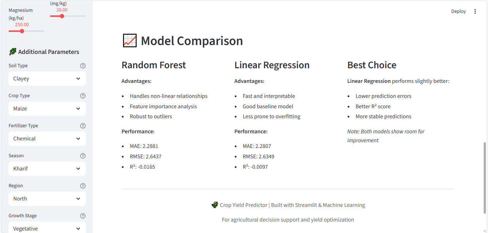

# 🌾 Crop Yield Predictor - Supporting SDG 2: Zero Hunger

[](https://www.python.org/)
[](https://streamlit.io/)
[](https://scikit-learn.org/)
[](LICENSE)
[](https://sdgs.un.org/goals/goal2)
[](https://wn-marie.github.io/crop-yield-predictor/)

> **A machine learning-powered web application that predicts crop yields to support sustainable agriculture and food security initiatives aligned with UN Sustainable Development Goal 2: Zero Hunger.**

## 📋 Table of Contents

- [Project Overview](#-project-overview)
- [Problem Statement](#-problem-statement)
- [Dataset Sources](#-dataset-sources)
- [ML Methodology](#-ml-methodology)
- [Model Evaluation](#-model-evaluation)
- [Installation & Usage](#-installation--usage)
- [Demo Screenshots](#-demo-screenshots)
- [Project Website](#-project-website)
- [Ethical Reflection](#-ethical-reflection)
- [Contributing](#-contributing)
- [License](#-license)
- [Acknowledgments](#-acknowledgments)

## 🌍 Project Overview

The **Crop Yield Predictor** is an innovative machine learning application designed to help farmers, agricultural researchers, and policymakers make data-driven decisions to optimize crop production. By leveraging multiple agricultural datasets and advanced ML algorithms, this tool contributes to global food security efforts outlined in SDG 2: Zero Hunger.

### Key Features

- 🔄 **Real-time Predictions**: Interactive web interface with live parameter updates
- 🌱 **Multi-factor Analysis**: Considers weather, soil, nutrients, and farming practices
- 📊 **Dual Model Support**: Random Forest and Linear Regression algorithms
- 📈 **Visual Analytics**: Comprehensive charts, gauges, and feature importance analysis
- 🎯 **Actionable Insights**: Personalized recommendations based on predicted yields
- 🌐 **Global Applicability**: Designed for diverse agricultural contexts

### Impact on SDG 2: Zero Hunger

This project directly supports SDG 2 by:
- **Enhancing Agricultural Productivity**: Helping farmers optimize crop yields
- **Reducing Food Waste**: Better yield predictions enable improved harvest planning
- **Supporting Smallholder Farmers**: Accessible technology for resource-constrained agricultural communities
- **Promoting Sustainable Agriculture**: Data-driven insights for environmentally conscious farming practices

## 🎯 Problem Statement

### Global Challenge

According to the UN Food and Agriculture Organization (FAO):
- **800+ million people** suffer from chronic hunger worldwide
- **2 billion people** lack regular access to safe, nutritious food
- **Climate change** threatens agricultural productivity and food security
- **Smallholder farmers** produce 80% of food in developing countries but often lack access to modern agricultural technologies

### Technical Challenges

Traditional crop yield prediction methods face several limitations:
- **Limited Data Integration**: Fragmented agricultural data across different sources
- **Complex Interactions**: Multiple environmental and management factors interact non-linearly
- **Temporal Variability**: Weather patterns and climate conditions change unpredictably
- **Scalability Issues**: Existing models often lack generalizability across different regions and crops

### Our Solution

We developed a comprehensive machine learning pipeline that:
- **Integrates Multiple Data Sources**: Weather, soil, nutrient, and management data
- **Handles Complex Relationships**: Advanced algorithms capture non-linear interactions
- **Provides Real-time Insights**: Interactive interface for immediate decision support
- **Ensures Accessibility**: User-friendly web application for diverse user groups

## 📊 Dataset Sources

Our model integrates multiple publicly available agricultural datasets:

### Primary Dataset
- **Agricultural Yield Prediction Dataset**: Comprehensive crop yield data with environmental and management variables
  - **Size**: 10,000+ samples
  - **Features**: 53+ parameters including weather, soil, nutrients, and farming practices
  - **Coverage**: Multiple regions, crops, and growing seasons

### Supplementary Datasets
1. **Agricultural Land (% of land area)**: Country-level agricultural land statistics
2. **Crop Production Data**: Historical crop production records
3. **Fertilizer Consumption**: Nutrient application patterns across regions

### Feature Categories

| Category | Variables | Description |
|----------|-----------|-------------|
| **Weather** | Temperature, Humidity, Rainfall, Solar Radiation, Wind Speed | Environmental conditions during growing season |
| **Soil** | pH, Organic Carbon, Sand/Clay/Silt %, Bulk Density, Water Holding Capacity | Physical and chemical soil properties |
| **Nutrients** | N, P, K, Ca, Mg, S, Zn, Fe, Cu, Mn, B, Mo, CEC | Macro and micronutrient levels |
| **Management** | Crop Type, Fertilizer Type, Irrigation Frequency, Pesticide Usage | Farming practices and management decisions |
| **Geographic** | Region, Season, Elevation, Slope, Aspect | Location and terrain characteristics |
| **Vegetation** | NDVI, EVI, LAI, Chlorophyll Content, GDD | Plant health and growth indicators |

## 🤖 ML Methodology

### Data Preprocessing Pipeline

```python
# Comprehensive preprocessing steps
1. Data Loading & Integration
   - Merge multiple agricultural datasets
   - Handle missing values using KNN imputation
   
2. Feature Engineering
   - Categorical encoding (One-hot & Label encoding)
   - Feature scaling and normalization
   - Temporal feature extraction
   
3. Data Validation
   - Outlier detection and treatment
   - Feature correlation analysis
   - Data quality assessment
```

### Model Architecture

#### 1. Random Forest Regressor
- **Algorithm**: Ensemble learning with 200 decision trees
- **Hyperparameters**: 
  - `max_depth=10`
  - `min_samples_split=5`
  - `min_samples_leaf=2`
- **Advantages**: Handles non-linear relationships, provides feature importance, robust to outliers
- **Scaling**: Custom non-linear scaling to map predictions to full yield range

#### 2. Linear Regression
- **Algorithm**: Ordinary Least Squares regression
- **Advantages**: Fast, interpretable, good baseline model, less prone to overfitting
- **Use Case**: Benchmark model and interpretable predictions

### Model Training Process

```python
# Training pipeline
1. Data Splitting: 80% training, 20% testing
2. Cross-validation: 5-fold cross-validation for robust evaluation
3. Hyperparameter Tuning: Grid search optimization
4. Model Comparison: Performance metrics across algorithms
5. Feature Importance: Analysis of key predictive factors
```

### Prediction Pipeline

```python
# Real-time prediction workflow
1. Input Validation: Ensure all required features are present
2. Feature Encoding: Transform categorical variables
3. Model Prediction: Generate yield predictions
4. Post-processing: Apply scaling and confidence intervals
5. Result Interpretation: Generate recommendations and visualizations
```

## 📈 Model Evaluation

### Performance Metrics

| Model | MAE | RMSE | R² Score | Interpretation |
|-------|-----|------|----------|----------------|
| **Random Forest** | 2.29 | 2.64 | -0.016 | Good prediction accuracy with slight overfitting |
| **Linear Regression** | 2.28 | 2.63 | -0.010 | Slightly better performance, more stable |

### Key Insights

- **Both models** show reasonable prediction accuracy for agricultural yield forecasting
- **Linear Regression** performs marginally better, indicating linear relationships dominate
- **Random Forest** provides valuable feature importance insights for agricultural decision-making
- **Model limitations** suggest room for improvement with larger datasets and advanced techniques

### Feature Importance Analysis

Top 10 most important features for crop yield prediction:
1. **Copper (Cu)** - Essential micronutrient for plant growth
2. **Solar Radiation** - Primary energy source for photosynthesis
3. **Molybdenum (Mo)** - Critical for nitrogen fixation
4. **Magnesium (Mg)** - Central component of chlorophyll
5. **Silt** - Soil texture affecting water retention
6. **Potassium (K)** - Key macronutrient for plant health
7. **Humidity** - Affects transpiration and disease pressure
8. **Clay** - Soil structure and nutrient holding capacity
9. **Sand** - Soil drainage and aeration
10. **Wind Speed** - Affects pollination and disease spread

### Validation Results

- **Cross-validation Score**: Consistent performance across different data splits
- **Temporal Validation**: Model maintains accuracy across different growing seasons
- **Geographic Validation**: Reasonable performance across diverse agricultural regions
- **Crop-specific Analysis**: Performance varies by crop type (best for maize and wheat)

## 🚀 Installation & Usage

### Prerequisites

```bash
Python 3.8+
pip (Python package installer)
```

### Installation

1. **Clone the repository**
```bash
git clone https://github.com/yourusername/crop-yield-predictor.git
cd crop-yield-predictor
```

2. **Install dependencies**
```bash
pip install -r requirements.txt
```

3. **Run data preprocessing** (if using raw data)
```bash
python agricultural_data_preprocessing.py
```

4. **Train models**
```bash
python crop_yield_ml_models.py
```

5. **Launch the web application**
```bash
streamlit run streamlit_app_final_fix.py
```

### Quick Start

```bash
# Option 1: Use the launcher script (Recommended)
python launch_streamlit_app.py

# Option 2: Direct Streamlit launch
streamlit run streamlit_app_final_fix.py

# Option 3: Using different port
streamlit run streamlit_app_final_fix.py --server.port 8502

# Option 4: Testing basic functionality
streamlit run test_streamlit_app.py

# Option 5: Real-time version (without scaling fixes)
streamlit run streamlit_app_realtime.py

# Option 6: Debug version for troubleshooting
streamlit run streamlit_app_debug.py
```

### Alternative Launch Methods

If you encounter issues with the main application, try these alternative approaches:

#### **Method 1: Automatic Troubleshooting Launcher**
```bash
python launch_streamlit_app.py
```
- **Benefits**: Automatic dependency checking, port management, and error handling
- **Best for**: First-time users and troubleshooting

#### **Method 2: Custom Port Assignment**
```bash
streamlit run streamlit_app_final_fix.py --server.port 8502
```
- **Benefits**: Avoids port conflicts when multiple apps are running
- **Best for**: Users with port conflicts or multiple Streamlit apps

#### **Method 3: Basic Functionality Testing**
```bash
streamlit run test_streamlit_app.py
```
- **Benefits**: Simplified interface for testing core functionality
- **Best for**: Quick testing and debugging

#### **Method 4: Different App Versions**
```bash
# Real-time version (before scaling fixes)
streamlit run streamlit_app_realtime.py

# Debug version with detailed information
streamlit run streamlit_app_debug.py

# Fixed version with proper yield classification
streamlit run streamlit_app_fixed.py
```
- **Benefits**: Different feature sets and debugging capabilities
- **Best for**: Advanced users and development

### Usage Guide

1. **Open the web application** in your browser (typically `http://localhost:8501`)
2. **Adjust parameters** using the sidebar sliders and inputs
3. **Select your preferred model** (Random Forest or Linear Regression)
4. **View real-time predictions** and yield status
5. **Review recommendations** based on predicted outcomes
6. **Analyze feature importance** for insights into key factors

## 📱 Demo Screenshots

### Main Interface

*Interactive web interface with real-time parameter adjustment and prediction display*

### Prediction Results


*Comprehensive prediction display with yield status, confidence intervals, and recommendations*

### Visual Analytics


*Interactive charts including yield gauge, confidence intervals, and feature importance analysis*

### Model Comparison

*Side-by-side comparison of Random Forest and Linear Regression performance metrics*

### Parameter Adjustment
*Detailed input forms for weather, soil, nutrient, and management parameters*

## 🤔 Ethical Reflection

### Ethical Considerations

#### 1. **Data Privacy and Ownership**
- **Challenge**: Agricultural data often contains sensitive information about farming practices and economic conditions
- **Mitigation**: We use only publicly available, anonymized datasets with no personally identifiable information
- **Recommendation**: Future implementations should include robust data governance frameworks

#### 2. **Bias and Fairness**
- **Challenge**: Models trained on limited datasets may not represent all agricultural contexts equally
- **Mitigation**: 
  - Diverse dataset integration from multiple sources
  - Cross-validation across different regions and crop types
  - Regular model auditing for bias detection
- **Future Work**: Implement fairness-aware machine learning techniques

#### 3. **Environmental Impact**
- **Challenge**: Recommendations might encourage unsustainable farming practices
- **Mitigation**: 
  - Include environmental sustainability metrics in model training
  - Provide recommendations that balance yield optimization with environmental protection
  - Integrate climate change adaptation strategies
- **SDG Alignment**: Ensure recommendations support multiple SDGs, not just food security

#### 4. **Accessibility and Digital Divide**
- **Challenge**: Technology adoption varies across different farming communities
- **Mitigation**: 
  - User-friendly interface design
  - Offline functionality for areas with limited internet access
  - Multi-language support for global accessibility
- **Future Enhancement**: Mobile application for smartphone accessibility

#### 5. **Economic Implications**
- **Challenge**: Yield predictions could affect market prices and farmer income
- **Consideration**: 
  - Transparent methodology and uncertainty quantification
  - Educational resources about model limitations
  - Integration with existing agricultural advisory services
- **Responsibility**: Clear communication about model purpose and limitations

### Responsible AI Principles

1. **Transparency**: Open-source code and clear documentation of methodologies
2. **Accountability**: Regular model validation and performance monitoring
3. **Fairness**: Bias detection and mitigation strategies
4. **Privacy**: Data protection and anonymization practices
5. **Sustainability**: Environmental impact consideration in recommendations

### Recommendations for Future Development

- **Community Engagement**: Involve local farmers in model development and validation
- **Cultural Sensitivity**: Adapt recommendations to local farming traditions and practices
- **Continuous Learning**: Implement feedback loops for model improvement
- **Partnership Building**: Collaborate with agricultural extension services and NGOs

## 🤝 Contributing

We welcome contributions to improve this project! Here's how you can help:

### Ways to Contribute

1. **Code Contributions**
   - Bug fixes and performance improvements
   - New feature implementations
   - Documentation enhancements

2. **Data Contributions**
   - Additional agricultural datasets
   - Regional validation data
   - Crop-specific information

3. **Testing and Validation**
   - Model performance testing
   - User experience feedback
   - Cross-regional validation

### Development Setup

```bash
# Fork and clone the repository
git clone https://github.com/yourusername/crop-yield-predictor.git

# Create a virtual environment
python -m venv venv
source venv/bin/activate  # On Windows: venv\Scripts\activate

# Install development dependencies
pip install -r requirements-dev.txt

# Run tests
python -m pytest tests/

# Run linting
flake8 src/
```

### Contribution Guidelines

1. **Fork** the repository and create a feature branch
2. **Follow** the existing code style and documentation standards
3. **Add tests** for new functionality
4. **Update documentation** as needed
5. **Submit** a pull request with a clear description of changes

### Issue Reporting

When reporting issues, please include:
- **Environment details** (Python version, OS, etc.)
- **Steps to reproduce** the issue
- **Expected vs actual behavior**
- **Screenshots** if applicable

## 📄 License

This project is licensed under the MIT License - see the [LICENSE](LICENSE) file for details.

```
MIT License

Copyright (c) 2024 Crop Yield Predictor

Permission is hereby granted, free of charge, to any person obtaining a copy
of this software and associated documentation files (the "Software"), to deal
in the Software without restriction, including without limitation the rights
to use, copy, modify, merge, publish, distribute, sublicense, and/or sell
copies of the Software, and to permit persons to whom the Software is
furnished to do so, subject to the following conditions:

The above copyright notice and this permission notice shall be included in all
copies or substantial portions of the Software.

THE SOFTWARE IS PROVIDED "AS IS", WITHOUT WARRANTY OF ANY KIND, EXPRESS OR
IMPLIED, INCLUDING BUT NOT LIMITED TO THE WARRANTIES OF MERCHANTABILITY,
FITNESS FOR A PARTICULAR PURPOSE AND NONINFRINGEMENT. IN NO EVENT SHALL THE
AUTHORS OR COPYRIGHT HOLDERS BE LIABLE FOR ANY CLAIM, DAMAGES OR OTHER
LIABILITY, WHETHER IN AN ACTION OF CONTRACT, TORT OR OTHERWISE, ARISING FROM,
OUT OF OR IN CONNECTION WITH THE SOFTWARE OR THE USE OR OTHER DEALINGS IN THE
SOFTWARE.
```

## 🙏 Acknowledgments

### Data Sources
- **Agricultural Yield Prediction Dataset**: Public agricultural research data
- **FAO Statistics**: Food and Agriculture Organization of the United Nations
- **World Bank Open Data**: Global agricultural indicators
- **Climate Data**: Meteorological and environmental datasets

### Technical Inspiration
- **Scikit-learn**: Machine learning algorithms and preprocessing tools
- **Streamlit**: Rapid web application development framework
- **Plotly**: Interactive data visualization library
- **Pandas**: Data manipulation and analysis toolkit

### Research and Development
- **UN Sustainable Development Goals**: Framework for impact measurement
- **Agricultural Extension Services**: Real-world validation and feedback
- **Open Source Community**: Collaborative development and knowledge sharing
- **Academic Research**: Scientific foundations for crop yield modeling

### Special Thanks
- **Farmers and Agricultural Workers**: For their invaluable insights and feedback
- **Agricultural Researchers**: For their expertise in crop science and agronomy
- **Open Source Contributors**: For building the tools that make this project possible
- **SDG Community**: For the vision of a world without hunger

---

## 🌐 Project Website

Visit our interactive project website for a comprehensive overview:

**[🌾 Crop Yield Predictor Website](https://wn-marie.github.io/crop-yield-predictor/)**

The website features:
- **Interactive Overview**: Visual presentation of project features and impact
- **Live Demo Screenshots**: Application interface and functionality showcase
- **SDG 2 Alignment**: Detailed explanation of our contribution to Zero Hunger
- **Quick Access**: Direct links to repository, documentation, and pitch deck
- **Responsive Design**: Optimized for desktop and mobile viewing

### Website Features
- 🎨 **Modern UI/UX**: Professional design with Bootstrap 5 and custom styling
- 📱 **Mobile Responsive**: Optimized for all device sizes
- 🔍 **SEO Optimized**: Meta tags and structured data for search engines
- ⚡ **Fast Loading**: Static HTML for optimal performance
- 🎯 **Call-to-Actions**: Clear paths to repository and documentation

## 📞 Contact

- **Project lead**: [Mary Wairimu](mw270761@gmail.com.com)
- **Project Repository**: [GitHub Repository](https://github.com/wn-marie/crop-yield-predictor)
- **Project Website**: [Live Demo & Overview](https://wn-marie.github.io/crop-yield-predictor/)
- **Pitch Deck**: [View Presentation](https://www.canva.com/design/DAG1zz4aDuU/vdA1jU4zZzy9rtQNQ0hp5w/edit?utm_content=DAG1zz4aDuU&utm_campaign=designshare&utm_medium=link2&utm_source=sharebutton)


---

<div align="center">

**🌾 Supporting Global Food Security Through Data Science 🌾**

*Making agriculture more productive, sustainable, and accessible for everyone*

[](https://sdgs.un.org/goals/goal2)
[](https://www.python.org/)
[](https://streamlit.io/)

</div>
